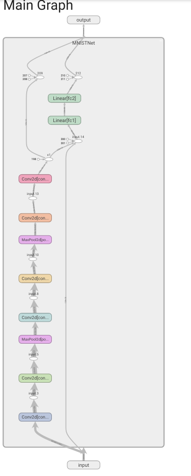
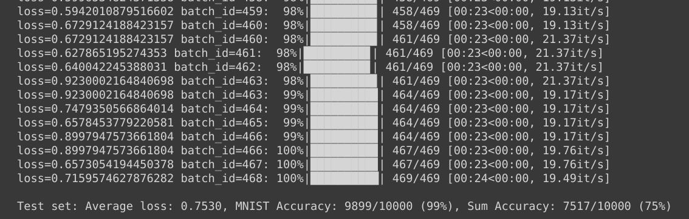

# sum-neural-network

## Task
Write a neural network that takes 2 inputs:

1.   an image from MNIST dataset, and
2.   a random number between 0 and 9

and gives two outputs:

1. the "number" that was represented by the MNIST image, and
2. the "sum" of this number with the random number that was generated and sent as the input to the network

## Data representation and generation
A custom dataset `MNISTRandomNumberGenerator` inherits torch.utils.data.Dataset and overrides the following methods:
* __len__ : returns the size of dataset
* __getitem__ : returns the following a) input data: a MNIST image and a random integer b) labels: MNIST class label and expected sum 

The MNIST dataset is downloaded using torchvision APIs and then a random number with sum is appended to input and target respectively. 
The random number is a one hot encoded vector. 

##  Training the network
* First the MNIST image is taken as an input to the network. 6 convolution layers and 2 max pooling layers are used to predict the class label of the image. 
* The random number as a one hot encoded vector is concatenated with the output layer
* Two fully connected networks are added to get the sum of predicted MNIST class label and random number. The `add` function is learnt by the network. 

* Hyperparameters used:
 - learning rate: 0.1
 - epochs: 20
* Loss function =  (NLL (negative log likelihood) loss for MNIST) + (NLL loss for the sum)
The NLL function penalizes correct predictions made with lower probabilities thus making the network learn better. 

## Result
Test set: Average loss: 0.7530, MNIST Accuracy: 9899/10000 (99%), Sum Accuracy: 7517/10000 (75%)

